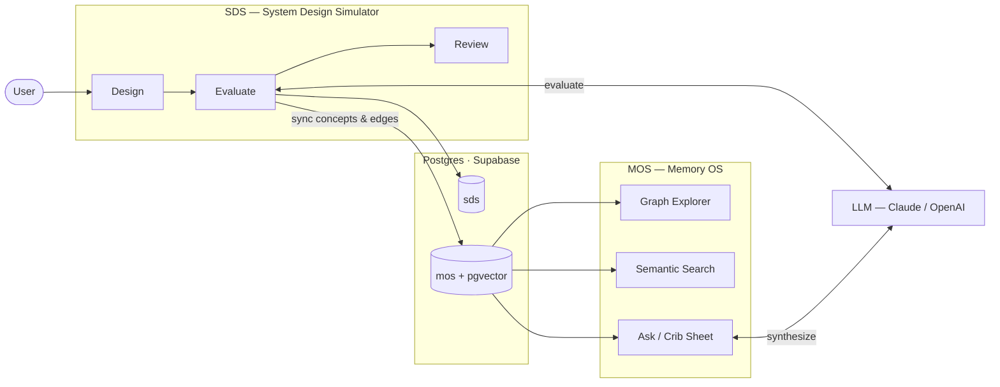

# ARC — Architecture Practice + Knowledge Graph

ARC is an AI-native system for structured architecture practice and persistent knowledge modeling.

It consists of two tightly integrated applications:

* **SDS (System Design Simulator)** — Time-boxed design practice with AI evaluation
* **MOS (Memory OS)** — A personal knowledge graph that stores and connects architectural insights

Every SDS session feeds MOS, converting ephemeral practice into structured, queryable knowledge.

---

# Problem

System design interviews — and real-world system architecture — require:

* Structured thinking under constraints
* Explicit articulation of tradeoffs
* Failure-mode reasoning
* Pattern recall across domains
* Feedback loops over time

Most practice sessions are isolated and forgotten.

ARC turns design sessions into durable, connected architectural memory.

---

# System Architecture



```
arc/
  sds/              Next.js app — System Design Simulator (port 3000)
  mos/              Next.js app — Memory OS (port 3001)
  shared/
    types/          Shared TypeScript types
    db/             Supabase client, Drizzle ORM schema, migrations
    llm/            LLM provider abstraction (Claude + OpenAI evaluator)
    embeddings/     Embedding provider
    auth/           Supabase Auth helpers
```

## Core Data Model

Single Supabase Postgres database with three schemas:

* **`sds`**

  * prompts
  * sessions
  * responses
  * evaluations
  * mos_sync (idempotent integration tracking)

* **`mos`**

  * nodes (knowledge graph)
  * edges (relationships)

* **`core`**

  * embeddings (pgvector)
  * search_results view

All tables enforce **Row Level Security (RLS)**.

User-scoped queries use Supabase JWT-based access.
Admin operations (migrations, SDS→MOS sync, embedding pipeline) use Drizzle with service role.

---

# SDS — System Design Simulator

Timed architecture practice with AI evaluation.

## Flow

1. Choose a design prompt
2. Select 30 or 60-minute mode
3. Write architecture (text + Mermaid diagrams)
4. Submit (manual or auto on timer expiry)
5. LLM evaluation
6. Persist structured results
7. Sync into MOS graph

## Evaluation Dimensions

| Dimension   | Measures                                         |
| ----------- | ------------------------------------------------ |
| Components  | Completeness of building blocks                  |
| Scaling     | Partitioning, replication, throughput            |
| Reliability | Retries, DLQs, circuit breakers                  |
| Trade-offs  | Consistency vs availability, cost vs performance |

## Routes

| Route                  | Purpose                      |
| ---------------------- | ---------------------------- |
| `/`                    | Start session / view history |
| `/session/[id]`        | Active design session        |
| `/session/[id]/review` | Evaluation results           |
| `/dashboard`           | Score history + trends       |

---

# MOS — Memory OS

Knowledge graph that grows automatically from design sessions.

## Node Types

`concept` · `pattern` · `domain` · `person` · `org` · `project` · `note` · `artifact`

Subtype via metadata (e.g. `{ subtype: 'ski_gear' }`).

## Edge Types

`related_to` · `used_in` · `practiced_at` · `depends_on` · `part_of` · `connected_to` · `custom`

## Features

* Force-directed graph explorer
* Hybrid semantic + keyword search
* LLM-powered synthesis ("What do I know about X?")
* Crib sheet generation
* Practice staleness detection

## Routes

| Route            | Purpose                    |
| ---------------- | -------------------------- |
| `/`              | Graph explorer             |
| `/search`        | Semantic search            |
| `/node/[id]`     | Node details               |
| `/crib/[nodeId]` | Generated crib sheet       |
| `/ask`           | Conversational graph query |

---

# SDS + MOS Integration

When an SDS session completes:

1. A `note` node is created in MOS
2. `concept` nodes are upserted
3. `practiced_at` edges are created
4. All mappings recorded in `sds.mos_sync`
5. Sync is idempotent for re-evaluation runs

The SDS review page links directly to synced graph nodes.
MOS surfaces stale concepts with links back to SDS.

---

# Database & Search Infrastructure

Initial migration: `shared/db/migrations/0000_initial.sql`

Includes:

* `mos.update_search_vector()` — auto tsvector updates
* `mos.enforce_edge_ownership()` — graph integrity enforcement
* `sds.update_updated_at()` — timestamp maintenance
* `mos.traverse_graph()` — recursive CTE graph traversal
* `core.semantic_search()` — cosine similarity search
* `core.search_results` — embedding metadata join view

---

# Key Design Decisions

* **Relational DB + pgvector instead of graph DB**
  Lower operational overhead, sufficient for scoped personal graph.

* **RLS-first security model**
  Security boundaries enforced at database layer.

* **LLM abstraction layer**
  Avoids provider lock-in.

* **Monorepo architecture**
  Simpler coordination for 0→1 build.

---

# Tech Stack

| Layer      | Technology                     |
| ---------- | ------------------------------ |
| Framework  | Next.js 15 + TypeScript        |
| Database   | Supabase (Postgres + pgvector) |
| Auth       | Supabase Auth                  |
| ORM        | Drizzle + Supabase client      |
| LLM        | Claude / OpenAI                |
| Embeddings | text-embedding-3-small         |
| Graph viz  | react-force-graph-2d           |
| Charts     | Recharts                       |
| Monorepo   | npm workspaces                 |

---

# Setup

## Prerequisites

* Node 18+
* Supabase project with vector extension

## Environment

```
NEXT_PUBLIC_SUPABASE_URL=
NEXT_PUBLIC_SUPABASE_ANON_KEY=
SUPABASE_SERVICE_ROLE_KEY=
SUPABASE_DB_URL=

ANTHROPIC_API_KEY=
OPENAI_API_KEY=

# Optional
LLM_PROVIDER=claude
EMBEDDING_PROVIDER=openai
EMBEDDING_MODEL=text-embedding-3-small
NEXT_PUBLIC_SDS_URL=http://localhost:3000
NEXT_PUBLIC_MOS_URL=http://localhost:3001
```

## Install & Run

```bash
npm install
npm run db:migrate
npm run db:seed
npm run dev:sds   # http://localhost:3000
npm run dev:mos   # http://localhost:3001
```

## Build

```bash
npm run build:sds
npm run build:mos
```

---

Built to explore AI-assisted architectural reasoning at the intersection of practice and memory.
